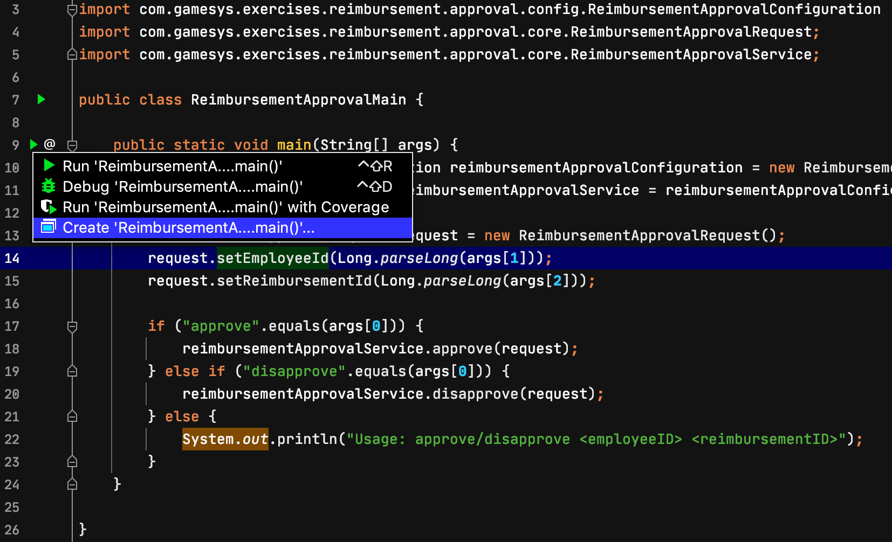
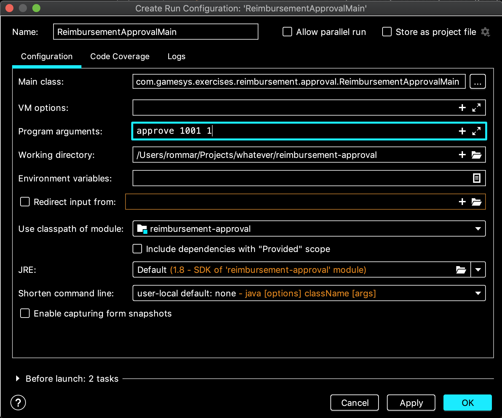
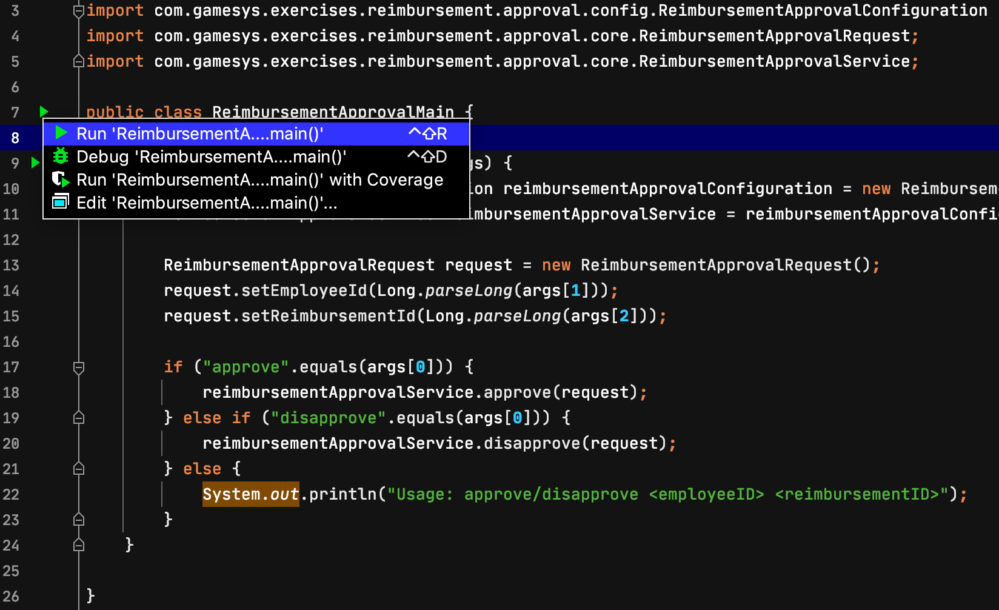

## Group Exercise: Evolving Interfaces

In this project you have an interface:

```java
public interface ReimbursementApprovalService {

    void approve(ReimbursementApprovalRequest request);

    void disapprove(ReimbursementApprovalRequest request);

}
```

It has been implemented in _DefaultReimbursementApprovalService_ and is being used in _ReimbursementApprovalMain_.

### Testing the application

This application can be tested using the Run option in IntelliJ.

First, visit the _ReimbursementApprovalMain_ class. Then, click the play icon on the left side of the _main()_ method.



You will see several menu options. Click on the _Create 'ReimbursementApprovalMain.main()'.

After that, you will see the Run/Debug Configuration dialog.



Update the Program Arguments with any valid value. For example:

* To approve employee 1001 with reimbursement 1, you write
```text
approve 1001 1
```
* To disapprove employee 1001 with reimbursement 1, you write
```text
disapprove 1001 1
```
* To disapprove employee 1002 with reimbursement 2, you write
```text
approve 1002 2
```

Click Apply and OK, after you have updated Program Arguments.

Then, back to the _main()_ method, click the play icon again. And, from the menu options, click on the _Run 'ReimbursementApprovalMain.main()'.



After running, you should see an output to the console similar to the following:

```shell script
=== Saved Approval ===
ReimbursementApproval{reimbursementId=1, employeeId=1001, approved=true}
=== End - Saved Approval ===

Process finished with exit code 0
```

### Actual Exercise

**Improvements**:
1. When approving or disapproving reimbursement requests, require an additional field for the username of the approver.
(Note: Modifiying the _ReimbursementApprovalRequest_ is not allowed here).
2. Also, when disapproving a reimbursement request, require a field for the reason of the disapproval.
(Note: Agaib, modifiying the _ReimbursementApprovalRequest_ is not allowed here).
